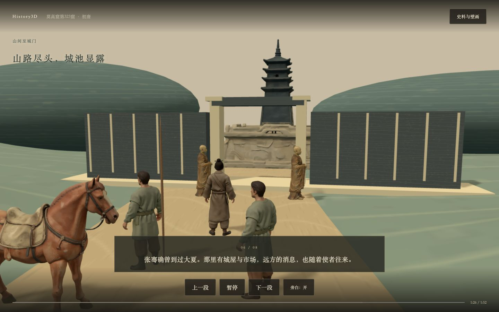

# History3D：今天的进展与核心思路

傅老师您好，今天我们围绕“怎样让用户走进壁画”调整了产品方向，并完成了一版可播放的本地样板。

**核心方向是：以壁画为入口，以 3D 空间为主体，以镜头、字幕和旁白带用户认识历史。先单向讲清故事，再考虑探索交互。**

## 为什么调整

原来的 Demo 已经有四页绘本、对白分支和真实 Tripo 资产，但用户读故事与看 3D 要在两套界面之间切换。3D 更像附加展示，尚未承担理解历史的作用。

我们尝试过两步：先让原壁画产生浮雕纵深，再让用户进入山道、按按钮前进和点击人物。入画过程得到了认可，但后半段暴露出问题：用户还不知道背景，就被要求探索；标注主要解释制作方法，没有讲清历史；场景缺少清楚的队伍、道路和目的地。

因此最终收敛为**先单向讲述**。不要求用户频繁切换角色，也不要求按 W 行走或点问题才能知道背景。镜头代表跟随使者的移动，故事随着空间和事件展开。

## 壁画能支持哪些场景

项目使用的是初唐莫高窟第323窟《张骞出使西域图》。敦煌研究院将它解释为三个主要画面：汉武帝拜金人、张骞拜别皇帝、汉使山间行进并抵达大夏。

我们据此确定画面结构，不把原来的“月氏接见”“大夏市场”当成这幅壁画已经画出的现场。山间行进与抵达城门可以拆成两个空间段落。

有一个重要边界：这幅画是后世图像记忆，含佛教叙事的改写。它可以支持“唐人如何画张骞”的呈现，不能直接证明汉代人物的面貌、服饰、建筑或张骞在城门遇见僧人。讲述中区分《史记》的记载、壁画的叙事和空间补全。

## 2D 与 3D 如何配合

- **2D 壁画**：交代来源，指明要进入的局部，也作为结尾的回看对象。
- **3D 空间**：呈现人物、道路、距离、遮挡和目的地，让远行具有人的尺度。
- **镜头**：负责引导、前进、停留与看见重要对象，不让用户承担导演工作。
- **字幕与旁白**：主动交代背景和历史内容，辅助理解眼前场景。
- **史料说明**：按需打开，提供来源及推定边界，不成为主线阅读门槛。


## 今天实际开发了什么

当前入口是 `/mural.html`，一轮约 **1 分 52 秒**，共八个讲述段落：认识壁画、宫殿金人、拜别、入山、持节西行、城池显露、僧人与佛塔、回看历史。

1. 自动镜头与章节时间线：用户点击开始后，镜头连续推进，最后回到原画。
2. 重新搭建山间与城门空间：连续山脊围出可辨认的道路，队伍成为近景，城门与佛塔成为远处目的地。
3. 使用六项 GLB 资产：复用使者、随从、马匹和旌节；新增 Tripo 僧人与佛塔，模型取代原先的平面人物剪影。
4. 八段本地中文旁白与对应字幕：内容直接随章节出现，区分史书中的出使背景与壁画中的佛教改写。
5. 播放控制：暂停、继续、上一段、下一段、旁白开关、重播和来源查看。
6. 资产加载保护：六项 GLB 校验 bytes/SHA-256；资产读取或校验失败时提示错误，不静默用占位模型替代。

新增两个 Tripo 文生模型任务均成功，分别消耗 20 credits，共 **40 credits**。它们是依据原画可见形态与色彩作文字描述后的生成候选，**不是原图直接转 3D，也不是考古复原**。



## 当前完成到哪里

这版已完成自动讲述的本地流程验证：六项模型加载与校验、中文音频播放、完整 112 秒自然播放到结尾、暂停、回看、旁白开关、来源查看及重播。构建和类型检查通过；指定可用 Python 运行时后的完整检查为 **34 个测试文件、230 项测试全部通过**。

范围要分清：**宫殿和拜别目前仍通过壁画镜头讲述；山间与城门进入了真正的三维场景。** 人物使用静态模型，队伍的位置与镜头在移动，尚未完成自然步行动画。环境、构图和模型风格也仍是第一版，需要继续美术打磨。本地运行与 GitHub 合并不等于线上部署或历史、视觉、权利审签完成。

## 后续应该优先做好什么

1. 先把“山间跟行 → 城门”做成稳定的一段：镜头路径、人物位置和目的地显露要自然，用户能说清跟着谁、去哪里。
2. 优化壁画风格：山石轮廓、矿物颜料色彩、衣纹和建筑材质统一，避免混入通用写实资产的感觉。
3. 校准生成资产：佛塔候选与原画轮廓仍需逐项比较，生成成功不等于视觉复原通过。
4. 补人物姿态与动作：减少模型平移感，按镜头需要完成行进、停步、持节等动作。
5. 在这段成立后，再推进宫殿与拜别的完整 3D 空间；自由探索和问答放在单向讲述之后。

## 来源与启动

- [敦煌研究院：张骞出使西域图](https://www.dha.ac.cn/info/1266/2524.htm)
- [《史记》卷123：大宛列传](https://zh.wikisource.org/wiki/史記/卷123#張騫)
- 场景代码：`viewer/src/mural/main.ts`、`cinema-world.ts`、`story.ts`。
- 资产与任务证据：`viewer/public/mural-assets/`。

在仓库根目录使用兼容 Node.js，正常查看不需要 Tripo API key、macOS 语音工具或再次生成资产：

```sh
npm ci
npm run build
npm run preview -- --host 127.0.0.1 --port 5193 --strictPort
```

打开 `http://127.0.0.1:5193/mural.html`。旧绘本入口 `/yuezhi.html` 保留。
