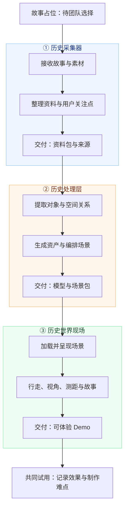

# 历史 3D 工具：分层开发与团队分工

团队对齐稿 · 2026-09-22 · 负责人待认领

故事占位：**[待选历史故事，例如丝绸之路]**。先跑效果 Demo，允许人工整理、脚本处理和手工摆放，再根据结果决定产品化范围。

## 分工总览

下文“本轮必做”指必须具备的能力，可用人工、配置或脚本完成；“后续可做”是开发范围候选，不是本轮全部承诺。

## ① 历史采集器：把输入整理成可处理的资料

**负责人：____　输入：故事、文字、图片、网页等素材　输出：资料包**

| 功能 / 开发模块 | 本轮必做 | 后续可做 |
|---|---|---|
| 输入入口 | 统一接收文字、图片与来源链接；可先用文件夹和模板 | 输入页面、文件上传、网页正文解析、多格式导入 |
| 用户关注点 | 记录想看的人、物、地点或路径，以及希望体验的视角 | 引导问答、兴趣选择、缺失信息追问 |
| 故事范围 | 整理时间、地点、背景与体验问题；未确定项保留为空 | 辅助收敛主题、自动提示时代和地点冲突 |
| 来源管理 | 为资料分配 ID，保留原文摘录、链接、图片出处与使用限制 | 去重、检索、来源预览、资料库 |
| 素材整理 | 区分文字、地图、器物图、建筑图等；选出可用参考图 | 图片裁切、分类、批量整理 |
| 证据标记 | 区分史料记载、推测复原、演示设定；记录缺口 | 证据冲突提示、补充资料推荐 |
| 人工确认 | 检查资料是否足以进入下一层，交付一个确认版本 | 编辑与确认界面、版本比较 |
| 异常处理 | 链接打不开或素材缺失时，记录原因并允许手工补齐 | 解析重试、导入进度、失败项单独处理 |

**具体交付**

- `story.md`：故事占位/选题、时间地点、关注对象、体验视角、未解决问题。
- `sources.json`：资料 ID、原文/摘录、链接或文件路径、证据说明。
- `references/`：图片、地图等素材，通过资料 ID 与来源对应。

**验收**：处理层无需重新猜故事意图，就能开始提取对象；关键素材能找到原始出处；未知信息没有被填成事实。

## ② 历史处理层：把资料变成可加载的世界

**负责人：____　输入：资料包　输出：资产文件 + 场景配置**

| 功能 / 开发模块 | 本轮必做 | 后续可做 |
|---|---|---|
| 信息提取 | 提取人物、器物、建筑、地形、时间、动作；可先人工列清单 | Agent 结构化提取、结果编辑与确认 |
| 空间关系 | 确定对象数量、相对位置、大小、方向与关键关系 | 自动布局、关系约束检查、多套布局候选 |
| 资产规划 | 判断哪些对象用 Tripo、现成模型或基础几何；区分主次 | 按重要性与成本自动选择制作方式 |
| 生成输入 | 为主资产准备参考图和生成描述，保留输入记录 | 提示词模板、参考图预处理、多候选生成 |
| Tripo 接入 | 通过脚本/接口提交任务、查询状态、保存结果与任务 ID | 队列、受控重试、并发限制、费用上限 |
| 资产验收 | 检查轮廓、背面、贴图、结构完整性，选择可用版本 | 自动预览、候选对比、质量检查辅助 |
| 尺度与朝向 | 统一单位、朝向和原点；校准尺寸与接地，注明依据 | 批量归一化、尺寸辅助标定 |
| 场景编排 | 生成摆放配置、基础地形、出生点、可行走范围 | 自动地形、场景编辑器、多场景组织 |
| 故事点编排 | 从资料中整理短文，关联对象/坐标与来源；交采集器复核 | 自动叙事编排、不同人物视角版本 |
| 资产优化 | 检查模型体积与贴图；运行吃力时减面、压缩或替换 | 自动优化、多精度资产、缓存复用 |
| 声音配置 | 可不做；需要时选有使用权的环境音并写入配置 | 音乐选择、旁白、空间音效 |
| 导出与恢复 | 导出完整场景包；保存生成状态，失败资产可用占位体继续 | 任务恢复、局部重新生成、版本管理 |

**具体交付**

- `entities.json`：对象清单、关键关系、尺寸依据和来源 ID。
- `assets/`：模型与贴图；资产清单记录模型路径、生成状态和采用版本。
- `scene.json`：物体摆放、地形、视角、可行走区域、故事点及来源关联。
- `experiments.csv`：生成输入、任务 ID、耗时、结果、人工修正与失败原因。

**验收**：现场层能按配置直接加载；比例、朝向、接地可解释；替换一个模型不必重写页面；失败项有明确状态。

## ③ 历史世界现场：把场景变成可理解的体验

**负责人：____　输入：场景包　输出：浏览器可体验 Demo**

| 功能 / 开发模块 | 本轮必做 | 后续可做 |
|---|---|---|
| 场景加载 | 读取配置、加载模型与贴图、显示加载/失败状态 | 分批加载、缓存、多个世界入口 |
| 基础渲染 | 地面、光照、背景与基础氛围；物体显示正确 | 天气、时段、视觉风格切换 |
| 移动控制 | 支持移动、转向、回到起点；处理基础碰撞与边界 | 手机触控、路径导航、无障碍控制 |
| 人尺度视角 | 相机眼高相对地面为 1.7 米，避免穿地或漂浮 | 可选人物高度与身份视角 |
| 视角切换 | 第一人称与俯视切换，保留可理解的位置关系 | 预设观景位、镜头导览 |
| 距离与尺度 | 两点测距或预设距离展示，使用统一米制坐标 | 尺寸标注、距离对比、路径长度 |
| 故事展示 | 点击对象或故事点看说明，能找到相关位置 | 分段叙事、时间轴、旁白联动 |
| 来源展示 | 展示出处、事实/推测标记，能查看资料说明 | 证据对照、复原版本比较 |
| 场景调整 | 先通过修改配置改变位置、比例和资产，并重新加载 | 拖拽摆放、旋转缩放、撤销、保存个人版本 |
| 声音播放 | 如有音频，提供播放开关与音量控制 | 按区域触发音效、声音渐变 |
| 稳定性与性能 | 检查加载时间、帧率、内存；缺失模型显示占位提示 | 自适应画质、手机适配、远程资源优化 |
| 保存与分享 | 本地可重复打开，留体验录屏 | 场景直达链接、截图明信片、赠言与二维码 |

**具体交付**

- 可运行的浏览器查看器及启动说明。
- 一份完整接入的样例场景、体验录屏和问题记录。
- 在约定演示设备上的加载与流畅度记录。

**验收**：用户能进入、移动、切视角、查看尺度与故事；出错有提示；刷新后能再次体验。

## 三层怎么对接

| 交接 | 必须包含 | 谁负责验收 |
|---|---|---|
| 采集器 → 处理层 | 故事范围、关注点、资料 ID、原始素材、证据标记 | 处理层检查是否能拆对象，有缺口退回补齐 |
| 处理层 → 世界现场 | 模型路径、对象 ID、坐标与尺度、出生点、故事点、来源关联 | 现场层检查能否加载、行走和显示内容 |
| 世界现场 → 前两层 | 问题截图、对象 ID、复现步骤与预期效果 | 内容问题归采集器，资产/布局问题归处理层 |

**共同约定一次，三方沿用：**

- 故事、资料、对象、资产使用稳定 ID；数据带格式版本。
- 米制、Y 轴向上；旋转用弧度、XYZ 顺序；模型底部中心为原点。
- 区分史料记载、推测复原、演示设定；来源关联到具体判断。
- 第一轮通过文件交接即可。密钥留在本地脚本或服务端，不放进网页或场景包。

## 容易重叠的工作，谁来主责

| 工作 | 主责 | 配合 |
|---|---|---|
| 历史内容与出处是否合理 | 采集器 | 处理层保留来源，现场层呈现 |
| Agent 提取、提示词和生成任务 | 处理层 | 采集器确认提取结果 |
| 模型大小、接地、摆放与空间关系 | 处理层 | 采集器给依据，现场层反馈显示结果 |
| 故事点文案 | 处理层整理，采集器审核 | 现场层负责展示与交互 |
| 场景编辑 | 处理层定义与保存场景数据 | 现场层负责编辑界面；本轮可先改配置 |
| 加载慢、卡顿 | 现场层定位与测量 | 处理层优化模型与贴图 |
| 保存与分享 | 现场层负责入口与访问体验 | 处理层输出完整可复用的场景包 |
| 端到端集成 | 指定一位兼任集成负责人：____ | 三方维护同一份可运行样例 |

## 最小推进顺序

1. **共同定交接样例**：故事留占位，先用几个基础物体约定资料与场景格式。
2. **三方并行**：采集器整理素材；处理层试主资产；现场层用灰盒开发移动、视角和测距。
3. **接一次完整 Demo**：真实资产替换占位物体，接上故事与来源，记录效果、耗时和人工修正点。
4. **再定产品化范围**：优先开发实际最慢、最难复用的步骤；账户、完整后台、复杂分享等暂不进入本轮。
